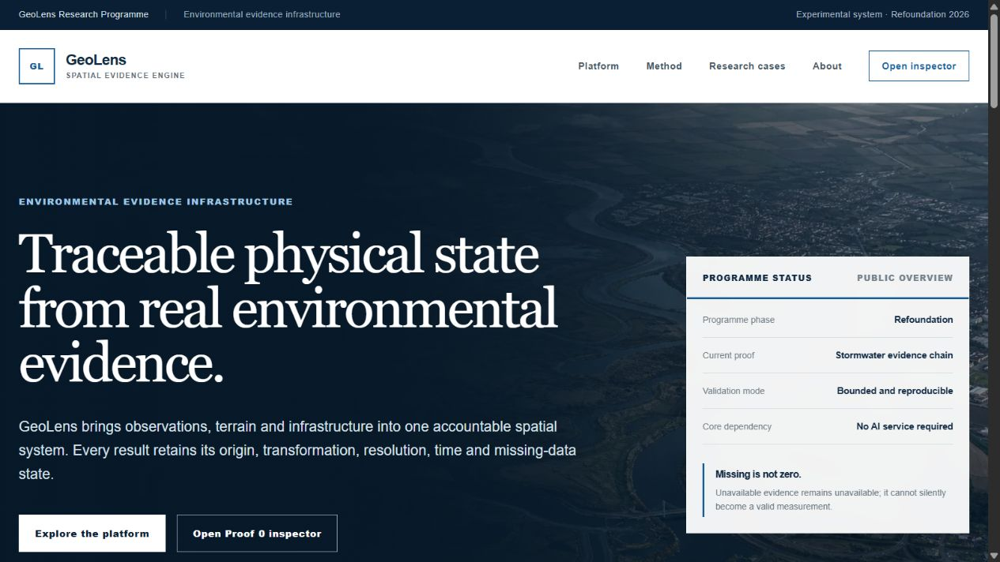

# GeoLens

**GeoLens is an experimental spatial evidence engine. It combines real environmental observations, terrain and infrastructure to derive physical results that remain traceable to their sources.**

GeoLens is being rebuilt around a simple rule:

> A result is useful only when we can explain where it came from, how it was transformed and what is still unknown.



*The public GeoLens interface presents the research programme, its current proof and the rule that missing evidence must never become a valid-looking zero.*

The first application is water moving from rainfall, across the surface and, where authoritative relationships are available, into a stormwater network.

## GeoLens in one minute

Rainfall, terrain, land cover and drainage infrastructure are usually published by different organisations, at different resolutions and in different formats. A map can make these layers look connected even when the underlying relationships have not been demonstrated.

GeoLens tries to build that connection explicitly:

1. acquire real rainfall, terrain and land-cover evidence for a bounded place and time;
2. retain the provider, dataset version, timestamps and original resolution;
3. derive an inspectable runoff quantity;
4. aggregate it over a defined surface or catchment;
5. connect it to observed infrastructure only when a source-backed attachment exists;
6. propagate it through known network directions without inventing missing links;
7. return the result together with its provenance, assumptions and missing-data state.

If an input is unavailable, GeoLens reports it as unavailable. It does not silently turn missing rainfall, elevation or land cover into zero.

GeoLens is not currently a flood forecast, a hydraulic sewer simulator or a generic risk-score dashboard.

## What we are trying to prove

The refoundation has one central question:

> Can real environmental evidence be transformed into an inspectable physical state without hiding uncertainty or inventing data?

For stormwater, the target chain is:

~~~text
real rainfall + real terrain + real land cover
                       |
                       v
             spatial evidence bundle
                       |
                       v
             inspectable runoff model
                       |
                       v
       contributing surface or catchment
                       |
                       v
          observed stormwater topology
                       |
                       v
          known downstream network state
                       |
                       v
        result + provenance + missing state
~~~

H3 is used to connect evidence spatially. It is an indexing and representation choice, not a claim that the original datasets have H3-native precision. The source resolution of IMERG, GLO-30, CLC, AHN and BGT remains visible.

## Where the project is today

GeoLens has two complementary operational proofs and two historical benchmark programmes.

| Case | Plain-language outcome | What is proven | What remains unresolved |
| --- | --- | --- | --- |
| Trento Proof 0 | The complete software chain works from real environmental inputs to a downstream result | Evidence composition, deterministic runoff, catchment aggregation, network propagation, provenance and mass balance | The small drainage network is a deterministic fixture, not surveyed municipal infrastructure |
| Amsterdam observed proof | GeoLens can read real Waternet pipes and nodes and derive a real, non-zero surface runoff source | Observed topology, elevation-based direction states, real rainfall/terrain/land cover and an inspectable surface contribution | No owner-published surface-to-pipe attachment has yet been found, so sewer propagation is deliberately blocked |
| Emilia-Romagna 2023 | A simple terrain-only concentration hypothesis was tested against an independent observed flood extent and did not perform better than chance | A reproducible historical benchmark, withheld evaluation data and honest negative evidence | A conditioned replay requires discharge, boundary, breach and terrain/channel evidence that is not currently available |
| Cumbria 2015 | A small public-only River Eden experiment can advance without waiting for the official archived model | The 56 km² Sheepmount–Old Sandsfield domain, real DTM/CLC/IMERG evidence, a fail-closed 2D replacement contract and its 10 m, 20 m and 40 m static computation grids are content-addressed before evaluation | Terrain gaps remain explicit; time-varying forcing and the numerical kernel are not yet materialized or verified, so no event run or prediction exists |

## Why development is deliberately constrained now

GeoLens is not paused. Its expansion is frozen while two independent external-evidence paths remain open: owner-supplied Waternet attachment evidence for Amsterdam and an Environment Agency model package for Carlisle.

The annotated Git tag `pre-external-evidence-baseline-v1` identifies commit `938b18fb66925e36236ea04a49eefdb2ca9826cb`. It records what GeoLens was before either requested package arrived. The tag is intentionally separate from the public release line.

Work can continue on the Cumbria gates that were already declared: time-varying forcing, fixture verification of the numerical kernel, stability, mass balance, prediction freeze and blind evaluation. Package integrity checks, minimal format/CRS/unit/schema adapters, tests, security, reproducibility and interface work can also continue.

What cannot happen is equally important. GeoLens will not add a new country or benchmark merely because data are available, anticipate the contents of an agency delivery, or select parameters and thresholds after seeing the expected answer. If the frozen baseline performs poorly, that result remains part of the record. A scientifically revised model may follow only as a separately versioned experiment shown beside the original result.


*Case 02 exposes the derived event-runoff concentration together with native resolution, transformation and publication state. Restricted or unavailable spatial evidence remains visibly withheld instead of being rendered as zero.*

This distinction matters. GeoLens does not describe a software pipeline as scientifically validated merely because it runs.

## Results so far

### Case 00 — Trento Proof 0

The verified live window observed 9.24 mm of rainfall. The model derived 2.957 m³ of runoff contribution and delivered the same volume to the fixture outfall with zero mass-balance difference.

In simple terms: the complete transformation chain is operational and numerically inspectable.

The environmental evidence is real. The network geometry is a small deterministic test fixture, so this result does not claim to represent the real Trento drainage system.

### Case 01 — Amsterdam urban drainage proof

GeoLens currently exposes:

- 47 observed Waternet nodes;
- 47 active stormwater pipes;
- 4 explicitly typed rainwater outfalls;
- 26 known and 21 ambiguous pipe directions;
- one known upstream path containing 5 nodes and 4 pipes;
- 696 H3 r13 surface cells classified from BGT and conditioned with AHN4 terrain;
- 100 contributing cells representing 3,676.73 m²;
- 3.835 mm of real IMERG rainfall for the selected window;
- 11.4145 m³ of derived surface runoff.

The 11.4145 m³ value is a traceable environmental source term. GeoLens does not present it as observed sewer inflow because the authoritative relationship between the contributing surface and an exact Waternet asset is missing.

The API therefore keeps propagation blocked. The experimental BGT/AHN outlet remains labelled as conditioned and not observed.

### Case 02 — Emilia-Romagna 2023 historical benchmark

The Forlì benchmark reconstructs the 16–18 May 2023 event using inputs that are kept separate from the official post-event flood extent.

The model uses:

- all 96 expected IMERG Final Run V07 half-hour granules;
- a bounded native rainfall grid with a mean 48-hour accumulation of 93.982 mm;
- real GLO-30 elevation and slope;
- real CLC land-cover classes;
- official DBTR geometry for water, wet areas, riverbeds, embankments and buildings;
- a frozen 30 m evaluation grid containing 130,307 eligible cells.

The first runoff-and-routing baseline derived 6,176,691.50 m³ over 129,841 source cells and conserved that volume to floating-point precision.

Only after the prediction protocol was frozen did GeoLens compare the result with the independent regional flood extent. The terrain-only concentration score returned:

- ROC AUC: 0.491624;
- average precision: 0.277679;
- observed flooded-cell prevalence: 0.286815.

That is near-random discrimination. The result is retained as useful negative evidence: raw GLO-30 D8 concentration without depression conditioning, river stage, discharge, breach behaviour, embankment hydraulics or downstream boundary conditions does not reconstruct the observed flood footprint.

GeoLens makes no inundation-depth, probability or operational-forecast claim from this result.

### Case 03 — Cumbria 2015 protocol-qualified replay

The Carlisle candidate is no longer just a list of promising portals. GeoLens has frozen a public-only downstream-reach domain, a fail-closed hydraulic input protocol, an explicit experimental replacement-solver contract and a sealed blind-evaluation boundary for Storm Desmond from `2015-12-04T00:00:00Z` to `2015-12-07T00:00:00Z`. The Environment Agency model request is useful, but it is no longer on the critical path.

The audit verifies:

- all 144 expected NASA IMERG V07 Final Run half-hour granules acquired through the canonical Python `earthaccess` + `xarray` path and reduced to a content-addressed 3 × 4 native-grid accumulation outside Git;
- all 288 expected 15-minute qualified flow observations and all 288 level observations at Sheepmount on the River Eden; flow is input-only for the public baseline, while level remains comparison evidence;
- all 288 local rainfall observations at Willow Holme, retained as station comparison rather than basin-wide rainfall;
- four complete candidate upstream hydrographs: 288 qualified flow values each at Great Corby on the Eden, Greenholme on the Irthing, Cummersdale on the Caldew and Newbiggin Bridge on the Petteril;
- a local protocol envelope containing those four stations, with British National Grid required for future solver geometry and Ordnance Datum Newlyn required for vertical evidence;
- the four wider-domain hydrographs remain native-only boundary candidates; for the public Sheepmount reach, the replacement contract separately fixes a left-constant 15-minute transform with no gap filling and a versioned positive-excess discharge proxy;
- rainfall/runoff forcing restricted to the future local domain downstream of those inflows, so upstream catchments already represented by the hydrographs cannot be counted twice;
- accessible Environment Agency Recorded Flood Outlines and both Copernicus EMSR147 Carlisle vector products, structurally restricted to evaluation;
- a content-addressed blind-hindcast protocol that keeps both observed geometries sealed until the prediction artifact, code revision, physical wetness criterion and evaluation domain are frozen;
- official time-stamped Environment Agency LiDAR metadata: 550 source records over 241 intersecting OS grid references, with a deterministic selection of 231 pre-event records;
- all 231 selected 1 km records mapped to 30 official time-stamped DTM ZIP identities through the current survey-search contract, with source-to-archive and archive-inventory SHA-256 identities;
- a header-only probe of the mapped `2009 / 1 m / NY3555` identity returned `application/zip` and filename `lidar_tiles_dtm-2009-1-NY35ne.zip` while reading and storing zero archive bytes;
- a bounded DTM materialization path that downloaded six official pre-event archives, content-addressed every archive and source raster, rejected unsafe ZIP entries, preserved native British National Grid resolution and wrote only explicitly georeferenced 1 km windows outside Git;
- ten effectively missing pre-event terrain grid references after archive inspection: `NY3256`, `NY3257`, `NY3258`, `NY3259`, `NY3357`, `NY3358`, `NY3359`, `NY3859`, `NY3959` and `NY3960`;
- 16 event-valid WFD Cycle 1 river-context features intersecting the audit AOI, pinned independently from current OS Open Rivers;
- the 2011 official main report and appendices: the historical model began in 1999, was expanded with surveyed sections in 2003, calibrated against January 2005, and ran from four named upstream watercourse limits to Old Sandsfield; the reports expose none of the runnable cross-section, model or boundary files;
- 19 bounded Environment Agency Flood Model Locations records and six exact Carlisle model-group identities; pre-event groups `1313`, `1314`, `1797` and `8323` are request lineage only, while groups `2039` and `9458` are post-event and excluded from input and calibration;
- an Environment Agency Products 5, 6 and 7 request sent on 2 September 2026 for the four pre-event groups, covering reports, outputs, native model inputs, survey sections, boundary definitions, roughness, defence state, software, datum and reuse conditions; Product 4 and the two post-event model groups remain deliberately excluded, and the response is an optional comparison rather than an open-data replay dependency;
- a fail-closed `cumbria-model` intake contract that content-addresses any future delivery outside Git, inventories ten requested components and requires a separate scientific review before any component can become a candidate for physical-gate assessment;
- 291 current AIMS defence records in the bounded query, pinned as current context only: 114 have no asset start date, 56 start on or after the event and four report refurbishment after 2015;
- 349 current AIMS Channel records, also context only: 272 have no start date, 17 dated records start on or after the event, and the schema contains no hydraulic cross-sections, bed levels or roughness;
- a bounded CLC 2012 window on the official aligned 100 m EPSG:3035 grid: all 7,553 cells are available across 12 observed classes, with the 2011–2012 reference period and retrospective corrected-release identity both retained;
- an input-selected 56 km² British National Grid domain from Sheepmount to the documented Old Sandsfield limit, fixed without loading either observed flood extent;
- six official pre-event 1 m DTM archives totalling 280,161,858 bytes and 40 unique source GeoTIFFs, all retained outside Git with content hashes;
- 48 georeferenced 1 km windows from the 52 catalogue-selected references, including six explicit fallbacks to older pre-event source rasters already present in the selected archive set; 46 windows contain observed terrain and two contain only provider-declared NoData;
- 10 effectively missing 1 km references after real archive inspection: four absent from the catalogue selection, four absent from the selected and already materialized older archive rasters, and two represented only by NoData pixels;
- 30,678,994 valid elevation pixels and 17,321,006 NoData pixels across the 48 mapped windows, compressed to 36,148,351 physical bytes without replacing missing values with zero; solver execution remains blocked.
- a complete 72-hour IMERG accumulation over 12 finite native cells, ranging from 81.705 to 115.900 mm with a 102.971 mm cell mean; this remains coarse 0.1-degree evidence and is not sharpened by H3.
- a reproducible real-source composition for H3 cell `8a1955d9535ffff`, selected solely as the cell containing the frozen public-domain centre: 13,528 intersecting 1 m DTM pixels produce a mean elevation of 8.097 m, native CLC class `231` covers the cell, and two coarse IMERG footprints produce an area-weighted 72-hour accumulation of 98.784 mm. This is an inspection result, not routing or hydraulic state.
- replacement-solver protocol `cumbria-public-surface-flow-replacement-v0`, pinned as SHA-256 `b9db1fbc10cc0aeff5d3a4e24bf1afc5d66226902ecad92ce111f1fcfb60c89b`: a primary 20 m grid, predeclared 10 m and 40 m resolution sensitivities, adaptive CFL integration, explicit CLC runoff/Manning ranges, a dry-surface initial assumption, free outer outflow, nine mandatory scenarios, mass-balance accounting and a primary 0.05 m maximum-depth wetness criterion. It authorizes neither a run nor evaluation access.
- three content-addressed static computation grids materialized directly from the native DTM and CLC footprints, without H3 routing or categorical interpolation. On the primary 20 m mesh, 75,786 of 140,000 cells have complete terrain coverage, 64,214 remain unavailable, and a one-cell missing-data halo leaves 73,502 cells eligible for a future prediction. CLC covers every cell. The 10 m and 40 m sensitivity grids retain the same fail-closed rules.

This proves data access and narrows the missing physics; it is not yet a flood reconstruction. The four upstream series now have fixed identities, units, windows and sampling semantics, but their station coordinates are not asserted to be historical model cross-sections. Old Sandsfield (`NY332617`) is retained as the documented downstream model limit, not as an observed boundary: the nearby station search finds no observation at that limit and the historical boundary values remain missing. Sheepmount level remains an observation for comparison, not a downstream boundary. A separately screened station named Rockcliffe publishes a qualified groundwater-dip measure rather than a surface-water boundary, so it was explicitly rejected.

The public replacement makes its compromises visible instead of filling those gaps silently. It represents only 2D surface flow over available terrain, omits unavailable event-valid channel sections, defences and floodgates, treats the outer grid as free outflow without an imposed stage, starts the surface dry as a model assumption, and injects only the positive Sheepmount discharge above the first window sample through a declared footprint. The three footprint sizes, three grid resolutions and runoff/roughness ranges are fixed before either observed extent is opened; all nine scenarios must be reported, so no best-looking result can be selected afterwards.

The WFD layer contains only designated 1:50,000 river stretches. The current AIMS defence and channel inventories are updated daily, so present geometry, crest, condition and channel lines cannot masquerade as the December 2015 hydraulic state even when an asset has a pre-event start date. The official 2011 documents and Flood Model Locations catalogue now tell us which historical domain and model groups to request, but they do not provide the cited ISIS/TUFLOW package, cross-sections, roughness or boundary files. The 2015 investigation report is post-event context: it reports overtopping and bypass, with no defence breach, but no narrative location becomes model geometry.

The selected LiDAR catalogue rows and their download mapping are now pinned independently. The earlier `DTM / 2009 / 1M / NY3957` probe was invalid: it used a legacy route and a 1 km source reference where the active delivery service expects product id `lidar_tiles_dtm`, numeric resolution `1` and the containing 5 km tile `NY3555`. The current bounded search returns 590 survey products, including 123 time-stamped DTM identities; deterministic source-year and 5 km containment mapping resolves the 231 selected source rows to 30 archives. Two identities are labelled 2015, but only their individually selected 1 km source areas have exact pre-event survey dates. GeoLens must therefore mask every archive back to its mapped 1 km references and may not treat the whole 5 km ZIP as event-valid.

Manifest v0.20.0 preserves the original content-addressed public-baseline protocol, records what each acquisition and the first real composition contained, and links the canonically hashed replacement-solver contract to its static-grid materialization. The domain remains the 8 km × 7 km British National Grid rectangle selected from Sheepmount and the documented Old Sandsfield limit, without loading either observed flood extent. The six ZIP archives occupy 280,161,858 bytes. Their 40 unique source GeoTIFFs yielded 48 exact one-kilometre windows: 46 carry at least one real elevation sample, while `NY3859` and `NY3960` contain only the provider's NoData value. Four further catalogue-selected cells have no covering raster in the selected or already materialized older archive for the same 5 km tile. Together with the four original catalogue gaps, the effective missing set contains ten cells. Six windows use fully traceable older pre-event source rasters where the newer selected archive lacked usable coverage. The retained Float32 windows decode to 192,000,000 bytes and are stored as 36,148,351 bytes of deterministic gzip-compressed artifacts outside Git. CLC and IMERG add only bounded, native-grid artifacts and receipts; the original NASA granules are not copied. Missing pixels remain missing.

The static-grid receipt is SHA-256 `8cb59393a9eb368ab9298d0e64c5ae2e4ffbc2a087f40b6ae498ff29a2f251d2`. It identifies 21 unique compressed artifacts occupying 1,441,157 bytes and representing 25,725,000 decoded bytes. A solver cell receives elevation only when its entire native DTM footprint is available; otherwise it remains invalid. CLC classes are converted to the already frozen runoff and Manning parameter ranges by exact native-footprint area overlap. This preprocessing performed zero network requests, solver runs and evaluation runs. It does not authorize event execution or evaluation-reference access.

The same manifest now draws a hard spatial boundary between evidence and simulation. Terrain remains on its native 0.5 m, 1 m or 2 m British National Grid cells; CLC 2012 remains a 100 m categorical product in EPSG:3035; IMERG remains an approximately 0.1-degree, 30-minute observation in EPSG:4326. None is silently resampled onto another source's grid. EPSG:27700 is the declared exchange coordinate frame for overlap calculations, not a common raster grid.

H3 resolution 10 provides a reproducible catalogue and inspection index of 24,230 cells over the frozen hydraulic-protocol envelope, with an approximate mean cell area of 13,199 m2 near Carlisle. Each index value retains the source resolution and overlap semantics that produced it: terrain coverage and NoData statistics, CLC area fractions and IMERG native-cell overlap. H3 does not sharpen IMERG, retain sub-metre terrain detail, route water or store hydraulic state. The separate replacement contract now fixes a 400 × 350 primary grid at 20 m and 10 m / 40 m sensitivity grids in EPSG:27700; these are computation choices, not new source resolution claims.

The generic `spatial-evidence-index-v0.1.0` composer now makes that boundary executable. It accepts native source-footprint intersections rather than H3-labelled source measurements, requires an explicit area CRS and measurement method, preserves source identities, versions, acquisition times and resolutions, and rejects overlapping footprints or inconsistent precipitation windows. For Cumbria, coverage fractions use the H3 boundary projected into EPSG:27700 as their denominator; they are not compared against the different spherical area returned by the H3 catalogue library. Complete coverage yields terrain statistics, CLC area fractions and area-weighted rainfall. Partial or unavailable coverage yields `null` evidence plus explicit coverage diagnostics—never a partial valid-looking value. Observed `0 mm` remains zero. The synthetic single-cell fixture still verifies transformation semantics, and a separate 5.65 MB decoded / 96 KB compressed real-evidence artifact proves the same contract against byte-verified DTM, CLC and IMERG inputs. Its receipt and result hashes reproduce exactly. It covers one inspection cell only and does not create a solver state.

The blind evaluation boundary is executable as a dry verification too. It freezes six metrics—intersection over union, area precision, area recall, false-positive area, false-negative area and symmetric 95th-percentile boundary distance—in EPSG:27700. Missing observed coverage is excluded and reported rather than treated as dry; missing prediction coverage blocks evaluation. Environment Agency and Copernicus extents must be evaluated separately, so disagreement between them remains visible. Their geometry cannot select the domain, mesh, wetness threshold or model parameters, and cannot be visually inspected before the prediction is content-addressed. The 0.05 m primary wetness semantic and three reporting thresholds are now fixed, but no prediction or evaluation mask exists, so evaluation remains blocked.

The repository is also ready to receive an Environment Agency model delivery without trusting filenames or draft checksums. The shared intake command accepts `--kind cumbria-model`, resolves artifacts only beneath an explicit data root, recomputes byte length and SHA-256, leaves originals in place, writes a new non-overwriting receipt and performs no archive extraction. The package must declare all ten requested components and can reference only Products 5, 6 and 7 and model groups `1313`, `1314`, `1797` and `8323`; Product 4, post-event groups `2039`/`9458`, observed flood geometry and automatic replay promotion are rejected. Structural validity records receipt only. A second component-level review must verify temporal lineage, licence, CRS/units/datum and evaluation isolation, and even a fully accepted package becomes only ready for physical-gate assessment—not replay-eligible by itself. No Environment Agency delivery has been received.

This removes the static-grid blocker without hiding the ten effective terrain gaps or the NoData pixels inside partially covered windows. The archived EA model, channel sections, historical boundary values and defence state remain unavailable for an official-model reconstruction, but they are not on the critical path. The next engineering gate is to materialize the 15-minute Sheepmount and 30-minute IMERG forcing under the frozen transformations, then verify the local-inertial kernel on deterministic stability and mass-balance fixtures. Any later EA delivery will be reviewed as an optional comparison or physics upgrade. The two observed flood extents remain sealed until a prediction is frozen.

The deterministic manifest is [tests/ground-truth/cumbria-2015/manifest.json](tests/ground-truth/cumbria-2015/manifest.json). Re-run the open-service checks with:

~~~powershell
npm run audit:cumbria-access
npm run audit:cumbria-lidar-catalog
npm run audit:cumbria-hydrography
npm run audit:cumbria-hydraulic-context
npm run audit:cumbria-boundary-protocol
npm run audit:cumbria-hydraulic-domain
npm run audit:cumbria-public-baseline
npm run materialize:cumbria-dtm -- --data-root <external-directory>
npm run materialize:cumbria-dtm-masks -- --data-root <external-directory>
npm run materialize:cumbria-clc2012 -- --data-root <external-directory> --execute
npm run materialize:cumbria-imerg -- --data-root <external-directory> --execute
npm run materialize:cumbria-spatial-evidence -- --data-root <external-directory> --check
npm run materialize:cumbria-solver-grids -- --data-root <external-directory> --check
npm run prepare:cumbria-model-request
npm run plan:cumbria-dtm-materialization
npm run plan:cumbria-spatial-grid
npm run verify:cumbria-spatial-composition-fixture
npm run verify:cumbria-replacement-solver-protocol
npm run verify:cumbria-blind-evaluation-protocol
~~~

The CLC, IMERG, spatial-evidence and solver-grid commands are dry runs unless `--execute` is supplied. All reject a data root inside the repository or OneDrive. IMERG reuses the canonical NASA cache, so a verified repeat does not download the 144 granules again. For the composed cell and static solver grids, `--check` rebuilds the result in memory and compares the receipt and compressed artifacts byte for byte without writing files.

When a delivery arrives, prepare a draft package beside the originals and run the intake with explicit paths outside Git:

~~~powershell
npm run intake:external-evidence -- --kind cumbria-model --draft <draft.json> --data-root <delivery-directory> --output <new-receipt.json>
~~~

## For Amsterdam data owners and collaborators

GeoLens already uses public Waternet infrastructure, AHN4 terrain, BGT physical surfaces, PDOK/GWSW context, NASA IMERG rainfall, CORINE Land Cover and Copernicus GLO-30.

The specific missing relationship is not another rainfall or terrain layer. It is authoritative attachment evidence connecting a contributing surface to an observed stormwater destination.

Useful material could include:

- an Amsterdam owner-published BGT Inlooptabel;
- a hydraulic-model surface-to-inlet or surface-to-outfall relation;
- an exact crosswalk between BGT surface identifiers and Waternet assets;
- documentation of the relevant relationship semantics and identifiers;
- guidance to the municipal or Waternet team responsible for these data.

GeoLens will not infer an observed sewer attachment from proximity, polygon containment or a conditioned terrain outlet. Those may remain experimental proxies, but they cannot be represented as authoritative infrastructure evidence.

## The non-negotiable rules

### Missing is not zero

Zero is valid only when it is observed or legitimately derived. Provider failure, missing coverage and incomplete time windows remain explicit states.

### Real evidence comes before interpretation

Important values retain their provider, dataset, version, observation time, acquisition time, source resolution, transformation and quality state.

### Synthetic data cannot masquerade as real evidence

Fixtures are allowed for deterministic tests and explicit demos. They are structurally labelled as synthetic and cannot enter the real-data runtime as observations.

### Physical quantities come before generic scores

GeoLens prefers rainfall in millimetres, elevation in metres, slope in degrees, runoff depth, runoff volume and downstream accumulation. A normalised score is used only when its meaning is explicit.

### Uncertainty can stop the chain

Unknown pipe direction, missing attachment evidence or incomplete provider coverage can block propagation. A blocked result is more useful than a plausible-looking result built on invented assumptions.

## What GeoLens is

GeoLens is:

- a spatial evidence engine;
- a common evidence and missing-data contract;
- a set of real environmental-data providers;
- an inspectable deterministic runoff derivation;
- typed catchment and stormwater-network models;
- a bounded API and visual evidence inspector;
- a foundation for later environmental and infrastructure applications.

## What GeoLens is not

GeoLens does not currently claim to provide:

- flood probability or flood depth;
- pipe capacity, surcharge or sewer overflow probability;
- a calibrated hydraulic simulation;
- groundwater recharge;
- damage or financial-loss estimates;
- a generic 0–1 risk score;
- continent-scale real-time operation;
- AI-generated assessment, recommendations or confidence.

AI, Gemini, RAG, mineral prospectivity and the previous generic multi-hazard framing are outside the active runtime.

---

# Technical guide

The remainder of this document is for developers, data providers and reviewers who want to reproduce or inspect the implementation.

## Evidence contract

Every important evidence value retains:

- provider and dataset;
- dataset version when available;
- observation time or requested window;
- acquisition time;
- coordinate or H3 representation;
- original spatial resolution;
- sampling and transformation method;
- transformation version;
- quality status and missing reason;
- provider-specific source metadata.

Canonical evidence states are:

~~~text
available
missing
stale
out_of_coverage
auth_required
rate_limited
upstream_error
invalid_response
incomplete_window
synthetic_fixture
~~~

Observed zero is valid evidence. Missing is not zero.

## Active architecture

~~~text
apps/
  api/                 Fastify spatial-evidence API
  web/                 Next.js institutional site and evidence inspector

packages/
  evidence/            canonical Evidence<T> model and invariants
  providers/           IMERG, GLO-30, CLC, AHN and BGT providers
  stormwater/          runoff, catchments, topology and Waternet/GWSW models
  proof-zero/          end-to-end environmental composition

nasa-precip-engine/    canonical Python earthaccess + xarray IMERG service
copernicus-engine/     local acquisition tooling outside the active npm runtime
~~~

Active npm workspaces:

~~~text
apps/api
apps/web
packages/evidence
packages/providers
packages/stormwater
packages/proof-zero
~~~

The Python IMERG service is the only production precipitation path. GeoLens does not maintain a second TypeScript precipitation implementation with a synthetic zero fallback.

## Quick start

### Requirements

- Node.js 20 or newer;
- npm 10 or newer;
- Python 3.11 or newer;
- NASA Earthdata credentials for live IMERG;
- an official local CLC 2018 V2020_20u1 100 m GeoTIFF for live land-cover evidence.

Copernicus GLO-30, PDOK AHN4, PDOK BGT, Waternet public infrastructure and public PDOK/GWSW context do not require credentials.

### Install

~~~bash
npm install

cd nasa-precip-engine
python -m pip install -r requirements.txt
cd ..
~~~

Create local configuration files:

~~~powershell
Copy-Item nasa-precip-engine/.env.example nasa-precip-engine/.env
Copy-Item apps/api/.env.example apps/api/.env
~~~

Never commit environment files, credentials, service-key JSON or PEM files.

### Configure NASA IMERG

Set nasa-precip-engine/.env:

~~~text
EARTHDATA_USERNAME=...
EARTHDATA_PASSWORD=...
API_HOST=127.0.0.1
API_PORT=8001
LOG_LEVEL=INFO

IMERG_CACHE_DIR=D:/GeoLens/cache/imerg
IMERG_DISK_CACHE_TTL_SECONDS=2592000
GEOLENS_PYTHON=D:/GeoLens/venvs/nasa-precip/Scripts/python.exe
GEOLENS_TEMP_DIR=D:/GeoLens/tmp
~~~

IMERG source resolution is approximately 0.1 degree. H3 does not change that precision. Acquisition is bounded to the requested H3 scope plus one source-cell sampling margin. Cache identities include the area of interest so two places cannot share an accumulation.

Only complete, available windows may be persisted in the optional disk cache. An unavailable or incomplete cached result never becomes an observation or a zero.

The default service binds to the local machine. Use API_HOST=0.0.0.0 only when network access is intentional and protected.

### Configure CORINE Land Cover

Keep the official European raster outside the repository. A suitable Windows layout is:

~~~text
D:/GeoLens/data/clc/
  u2018_clc2018_v2020_20u1_raster100m/
    DATA/
      U2018_CLC2018_V2020_20u1.tif
~~~

Set apps/api/.env:

~~~text
PORT=3003
NASA_PRECIP_SERVICE_URL=http://127.0.0.1:8001
CLC_RASTER_PATH=D:/GeoLens/data/clc/u2018_clc2018_v2020_20u1_raster100m/DATA/U2018_CLC2018_V2020_20u1.tif
~~~

If the raster is absent, unreadable or outside coverage, CLC remains explicitly unavailable.

### Run

Start IMERG, the API and the web application together:

~~~bash
npm run dev
~~~

Default local endpoints:

- institutional site: http://localhost:3000
- Proof 0 inspector: http://localhost:3000/proof-zero
- GeoLens API: http://localhost:3003
- API health: http://localhost:3003/health
- IMERG service: http://localhost:8001
- Amsterdam observed proof: http://localhost:3003/api/infrastructure/amsterdam-waternet
- Amsterdam attachment intake: http://localhost:3003/api/infrastructure/amsterdam-waternet/attachment-intake
- Emilia-Romagna benchmark: http://localhost:3003/api/benchmarks/emilia-romagna-2023
- Emilia-Romagna map manifest: http://localhost:3003/api/benchmarks/emilia-romagna-2023/map-manifest
- ARPAE hydraulic evidence intake: http://localhost:3003/api/benchmarks/emilia-romagna-2023/hydraulic-evidence-intake
- Cumbria model evidence intake: http://localhost:3003/api/benchmarks/cumbria-2015/model-evidence-intake

The root launcher starts services in dependency order and waits for their health gates. The first uncached IMERG acquisition can take several minutes.

## APIs

### Observed Amsterdam infrastructure

GET /api/infrastructure/amsterdam-waternet acquires a small bounded response from the official [Amsterdam Waternet infrastructure API](https://api.data.amsterdam.nl/v1/docs/datasets/leidingeninfrastructuur.html).

Default bounding box:

~~~text
latitude  52.3375 – 52.3395
longitude 4.8978 – 4.8995
~~~

The response keeps these layers separate:

- observed Waternet topology and source receipts;
- pipe-invert direction and outfall connectivity;
- PDOK/GWSW management-area context;
- raw AHN4 terrain evidence;
- BGT physical-surface classification;
- the experimental conditioned BGT/AHN surface proxy;
- real IMERG, CLC and GLO-30 evidence;
- derived runoff and catchment contribution;
- the authoritative BGT Inlooptabel attachment boundary;
- the reason network propagation was or was not attempted.

The GWSW polygon containing the selected outfall is context only. Point containment does not prove that a surface drains to an outfall.

The companion GET /api/infrastructure/amsterdam-waternet/attachment-intake exposes the delivery gate for the owner-published BGT Inlooptabel requested from Amsterdam/Waternet. Its current state is `missing`; both attachment assessment and propagation remain `blocked`. A future package must retain the STOWA 2025 relation semantics, publisher authority, bounded selection, source records and content-addressed original artifacts. Receipt, integrity review and exact topology matching are separate operations. A reviewed package becomes only `ready_for_exact_observed_topology_match`: propagation remains blocked until its published asset code matches one observed Waternet pipe uniquely. Proximity, polygon containment and the conditioned BGT/AHN outlet cannot be promoted into observed attachment evidence.

### Cumbria model-delivery intake

GET /api/benchmarks/cumbria-2015/model-evidence-intake exposes the current Environment Agency Products 5/6/7 delivery state. It currently reports `missing`, ten explicit component records, blocked hydraulic-context assessment and blocked replay eligibility. The endpoint contains no external archive path or evaluation geometry. When a structurally valid receipt is eventually registered, it still cannot promote the delivery automatically: component review and a later physical-gate decision remain separate operations.

### Emilia-Romagna historical benchmark

GET /api/benchmarks/emilia-romagna-2023 returns a compact, versioned projection of the verified external checkpoint. It does not load or redistribute the 746 MB source archive.

The response exposes:

- the manifest version, artifact count and integrity method;
- event window, bounded area, metric grid and H3 representation choice;
- provider, dataset version, native resolution, role and state for each major source;
- complete IMERG granule coverage and deterministic runoff quantities;
- mass balance, model version and the incomplete DBTR window;
- the post-freeze blind evaluation and retained near-random negative result;
- the independent ARPAE station comparison;
- every conditioned-replay evidence gate, including missing and metadata-only states;
- permitted and forbidden scientific claims.

The institutional Case 02 page reads this endpoint through its evidence inspector. API unavailability is shown as an error; it cannot silently become a valid-looking benchmark result.

The companion GET /api/benchmarks/emilia-romagna-2023/hydraulic-evidence-intake exposes the external-delivery gate for the evidence requested from ARPAE. The current state is `missing` and replay eligibility is `blocked`. A future delivery must identify content-addressed artifacts and explicitly cover antecedent state, Montone and Rabbi inflows, downstream boundary, breach behaviour, embankment crests, bare-earth terrain, and channel geometry/roughness. Receipt, structural verification, scientific review and replay eligibility are separate states: receiving a file cannot promote it automatically. Missing components remain missing, chart digitisation and observed-extent leakage are rejected, and synthetic fixtures can test the contract but can never become real replay evidence. Original delivered files remain outside Git.

The companion GET /api/benchmarks/emilia-romagna-2023/map-manifest serves a deterministic publication-safe spatial projection. Five inspectable layers are aggregated from the pinned 30 m grid onto a nominal 300 m display grid: terrain-only D8 contributing area, mean GLO-30 elevation, dominant CORINE land-cover group, known DBTR permanent-water presence and event runoff concentration. Every layer retains native resolution, aggregation, evidence state, transformation version and attribution.

The event-runoff projection became renderable only after the official NASA Earthdata and GPM policies confirmed free use with source acknowledgement; it cites GPM_3IMERGHH V07 by DOI and does not redistribute source granules. The endpoint remains fail-closed for the observed V7 flood extent and ARPAE station geometry, which are registered but carry no map data while redistribution is restricted or still under review. The browser therefore cannot turn an unavailable layer into a visual zero, and neither concentration layer can be mistaken for inundation extent.

The checked-in display payload is reproducible from verified external artifacts:

```bash
npm run materialize:emilia-map -- --data-root C:\Users\dacan\GeoLens\data\emilia-romagna-2023
npm run verify:emilia-map -- --data-root C:\Users\dacan\GeoLens\data\emilia-romagna-2023
```

## External evidence intake

GeoLens includes one local intake command for future ARPAE, Amsterdam/Waternet and Cumbria model deliveries. It reads originals from a data directory outside Git, computes their byte counts and SHA-256 identities, validates the appropriate scientific contract and writes a new package receipt. It does not copy the originals and refuses to overwrite an existing receipt.

For future Waternet and Environment Agency packages, the scientific reference is `pre-external-evidence-baseline-v1` at commit `938b18fb66925e36236ea04a49eefdb2ca9826cb`. Review records and any resulting prediction provenance must retain that identity. Intake may normalize representation; it cannot change model semantics, establish an undocumented attachment or grant calibration access to withheld evaluation evidence.

~~~powershell
npm run intake:external-evidence -- --kind arpae --draft C:\path\to\arpae-draft.json --data-root C:\path\to\arpae-delivery --output C:\path\to\receipts\arpae-package.json

npm run intake:external-evidence -- --kind amsterdam --draft C:\path\to\amsterdam-draft.json --data-root C:\path\to\amsterdam-delivery --output C:\path\to\receipts\amsterdam-package.json

npm run intake:external-evidence -- --kind cumbria-model --draft C:\path\to\cumbria-model-draft.json --data-root C:\path\to\cumbria-model-delivery --output C:\path\to\receipts\cumbria-model-package.json
~~~

The draft is the corresponding package JSON with artifact entries containing `id`, `role`, portable `relativePath` and `mediaType`. Any draft `bytes`, `sha256` or local source-path fields are discarded and recomputed from `data-root`. Artifact paths and resolved symlinks must remain inside that root.

A successful command means only `structurally_valid`. It does not complete scientific review, prove an Amsterdam topology match or make the Emilia-Romagna replay eligible. Those remain separate fail-closed decisions.

### Generic Proof 0

POST /api/proof-zero/run accepts a bounded typed GeoJSON network and an explicit reference time. A complete example is available in apps/web/app/lib/fixture.ts.

Supported entities:

- Point node with type inlet, manhole or outfall;
- LineString pipe with type pipe;
- Polygon catchment with type catchment and an explicit outlet_node_id.

Proof 0 guardrails:

| Limit | Value |
| --- | ---: |
| Geographic span | 0.25° × 0.25° |
| GeoJSON features | 500 |
| Coordinates | 10,000 |
| Nodes | 100 |
| Pipes | 200 |
| Catchments | 50 |
| Catchment H3 cells | 500 |
| Request body | 1 MiB |

These are bounded research-system limits, not continent-scale performance claims.

## Technical benchmark notes

### Amsterdam direction and attachment semantics

Waternet endpoint invert levels are retained without rounding. The orientation model uses an inclusive 0.05 m resolvable-drop boundary and a separately visible 0.000001 m numeric comparison tolerance.

Direction can be known, unknown or ambiguous. The numeric tolerance handles serialisation noise; it is not a claim about survey accuracy.

The authoritative attachment boundary is modelled as STOWA 2025 BGT Inlooptabel or equivalent owner-published evidence. No such bounded Amsterdam relation has yet been located in the public catalogues.

The executable intake contract records five package states: `missing`, `received`, `under_review`, `verified` and `rejected`. Even `verified` means only that an external delivery may enter the existing exact-identifier assessment; it does not mean that a network attachment or propagated flow has been established. Synthetic fixtures can validate the contract but can never become observed infrastructure evidence.

### Emilia-Romagna reproducibility boundary

Case 02 is a retrospective reconstruction, not an as-known-at-the-time forecast. IMERG V07 was released after the event and is therefore labelled as retrospective model input.

The official regional flood extent is evaluation-only. It remained unread until protocol commit 110a217 froze the prediction, score and metrics. It cannot enter model input or calibration.

The common evaluation grid is EPSG:32632 at 30 m, 335 × 420 cells, over bounds [737790, 4895070, 747840, 4907670]. A cell-centre mask retains 130,307 eligible cells.

Important data-quality boundaries remain explicit:

- missing CLC classes use -1 and never class 0;
- NaN marks values outside the analysis area or unavailable numeric evidence;
- 119 DBTR features added after 16 May 2023 are excluded and counted;
- the current DBTR extract cannot reconstruct deleted or overwritten historical geometry;
- the regional PST terrain audit contains 560,965 missing values out of 5,069,731 pixels;
- no PST gap is silently filled from GLO-30;
- published charts are not digitised into unavailable numerical hydrographs;
- missing discharge, breach and boundary evidence keeps a conditioned replay blocked.

The ARPAE delivery contract makes that boundary executable: a package may be `received`, `under_review`, `verified` or `rejected`, while replay eligibility remains independently `blocked` until every required component is accepted as external evidence. Invalid or incomplete deliveries cannot become zero-filled model input.

External benchmark inputs remain outside Git. While the D volume is unavailable, the verified working copy is under C:/Users/dacan/GeoLens/data/emilia-romagna-2023; the manifest uses portable relative paths so it can move back to D without changing dataset identity.

Manifest v1.16.0 pins 55 benchmark artifacts totaling 746,444,721 bytes and records the completed NASA/GPM use-policy review. This includes the canonical IMERG cache and portable source grid, DBTR source and metadata, derived masks, terrain routing, runoff arrays, evaluation receipts and audited official reports. Restricted observed geometry and source archives are not redistributed through Git.

For the complete audit trail, phase state and source-by-source limitations, read [REFOUNDATION_PLAN.md](REFOUNDATION_PLAN.md) and the [Emilia-Romagna manifest](tests/ground-truth/emilia-romagna-2023/manifest.json).

The paths below point to the temporary verified copy on C. Change the four variables when the data move to another volume; the manifest identity and verification rules do not change.

~~~powershell
$benchmarkRoot = 'C:\Users\dacan\GeoLens\data\emilia-romagna-2023'
$clcRaster = 'C:\Users\dacan\GeoLens\data\clc\clc2018-forli-feature-service\U2018_CLC2018_V2020_20u1_Forli_feature_service_100m.tif'
$dbtrSource = 'C:\Users\dacan\GeoLens\downloads\dbtr-source\estraz_procons.gpkg'
$imergCacheRoot = 'C:\Users\dacan\GeoLens\cache\imerg'

npm run materialize:emilia-inputs -- $benchmarkRoot $clcRaster
npm run materialize:emilia-xdbtr -- --data-root $benchmarkRoot --source $dbtrSource
npm run materialize:emilia-imerg-cache -- --data-root $benchmarkRoot --metadata "$imergCacheRoot\v07_20230518T000000Z_48h_669b94d37ff0.json" --netcdf "$imergCacheRoot\v07_20230518T000000Z_48h_669b94d37ff0.nc"
npm run verify:emilia-inputs -- $benchmarkRoot
npm run materialize:emilia-terrain-routing -- $benchmarkRoot
npm run verify:emilia-terrain-routing -- $benchmarkRoot
npm run materialize:emilia-event-runoff -- $benchmarkRoot
npm run verify:emilia-event-runoff -- $benchmarkRoot
npm run evaluate:emilia-concentration -- --data-root $benchmarkRoot
npm run verify:ground-truth -- $benchmarkRoot
~~~

## Verification

Run deterministic verification:

~~~bash
npm run typecheck
npm test
npm run build
~~~

Live providers are opt-in and separate from deterministic fixtures:

~~~powershell
$env:GEOLENS_RUN_LIVE_PROVIDER_TESTS = '1'
$env:CLC_RASTER_PATH = 'D:/GeoLens/data/clc/u2018_clc2018_v2020_20u1_raster100m/DATA/U2018_CLC2018_V2020_20u1.tif'
$env:GEOLENS_IMERG_REFERENCE_TIME = '2026-08-20T00:00:00Z'
npm run test:live
~~~

Waternet, BGT and GWSW live checks:

~~~powershell
$env:GEOLENS_LIVE_WATERNET = '1'
$env:GEO_LENS_LIVE_BGT = '1'
npm run build --workspace=@geo-lens/providers
npm run build --workspace=@geo-lens/stormwater
node --test packages/providers/test/live-bgt.test.cjs
node --test packages/stormwater/test/live-amsterdam-wfs.test.cjs packages/stormwater/test/live-amsterdam-gwsw.test.cjs
~~~

A live-provider failure may reflect credentials, network, rate limits or incomplete upstream coverage. It must never produce a valid-looking zero.

## Scientific limits

- Runoff v0 is deterministic and inspectable, but not a calibrated flood model.
- Land-cover-derived imperviousness and runoff parameters are model inputs or proxies.
- GLO-30 slope and AHN/BGT terrain conditioning have different roles and remain separate.
- H3 resolution never replaces provider resolution.
- Waternet direction uses endpoint invert evidence; insufficient evidence remains unknown or ambiguous.
- The conditioned Amsterdam outlet is a model boundary, not an observed sewer attachment.
- Propagation does not model pipe capacity, storage, travel time, surcharge or overflow.
- No percentage confidence or production-readiness claim is generated without a separate validation procedure.

## Refoundation and project history

GeoLens originally contained a broad multi-hazard product, AI analysis, mineral exploration and contradictory data paths. The refoundation deliberately reduced the active system to one physically meaningful, provenance-complete chain.

The pre-overhaul repository is preserved on branch codex/pre-overhaul-snapshot-20260822. Do not rewrite that branch.

The public release line remains v0.1.0-alpha.4. The separate annotated tag `pre-external-evidence-baseline-v1` freezes commit `938b18fb66925e36236ea04a49eefdb2ca9826cb` for the Waternet and Environment Agency external-evidence tests; it is a scientific baseline, not a release claim. Current main may contain later maintenance and protocol-preserving work.

When repository materials disagree, use this order:

1. AGENTS.md
2. REFOUNDATION_PLAN.md
3. verified runtime behaviour
4. tests expressing intended behaviour
5. implementation
6. historical documentation

The durable execution state belongs in the plan, code, tests and commits, not in generated completion reports.
